# Assignment 1 - Part 3
*Shahar Tefler & Iris Berger*

## 1 - Orthographic Projection
We removed the centring trick implemented in the previous assignment, and used viewport transformation in order to place the model at the center of the screen.

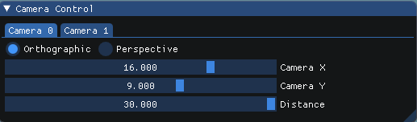

- The `CameraX` is the `left` and `right` parameters (symetrically).
- The `CameraY` is the `bottom` and `top` parameters (symetrically).
- The `Distance` is the `near` and `far` parameters (symetrically).

Let's see the result using different view volumes:

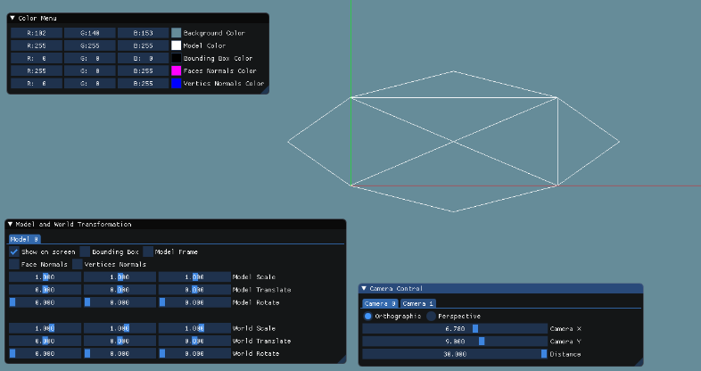

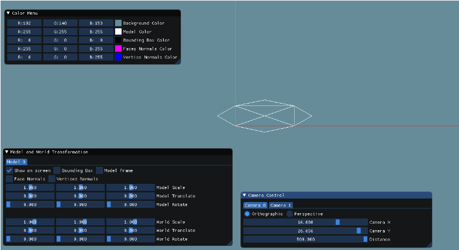

## 2 - Window Adjustment
We added a function that updates the window size in `Renderer` when changed:
```cpp
void ChangeFrameSize(int width, int height, Renderer& renderer)
{
	windowWidth = width;
	windowHeight = height;

	glViewport(0, 0, windowWidth, windowHeight);
	renderer.SetViewport(windowWidth, windowHeight);
}
```

And now, the mesh viewer changes according to screen size.

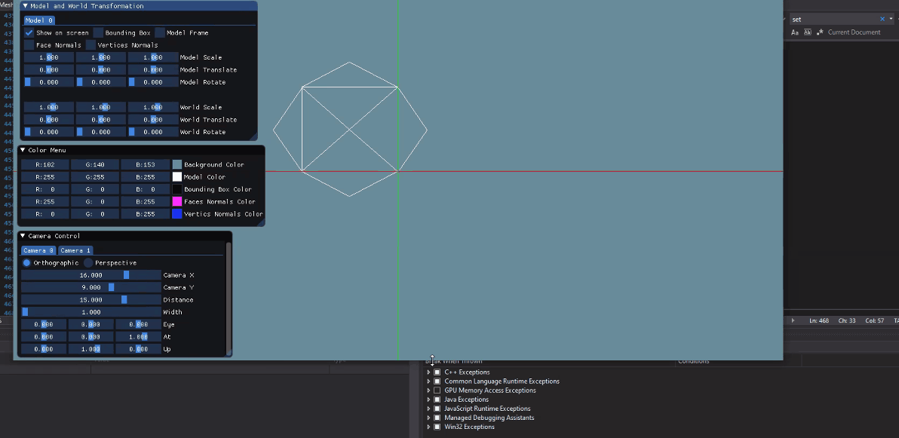

## 3 - Axes of model and world
### World Axes

We drew the origin and the 3 axes:
- `Origin` is at the center: `(width / 2, height / 2, depth / 2)`
- `AxisX` has 2 enpoints: 
  - `(0, height / 2, depth / 2)`
  - `(width, height / 2, depth / 2)`
- `AxisY` has 2 enpoints: 
  - `(width / 2, height, depth / 2)`
  - `(width / 2, 0, depth / 2)`
- `AxisZ` has 2 enpoints: 
  - `(width / 2, height / 2, 0)`
  - `(width / 2, height / 2, depth)`

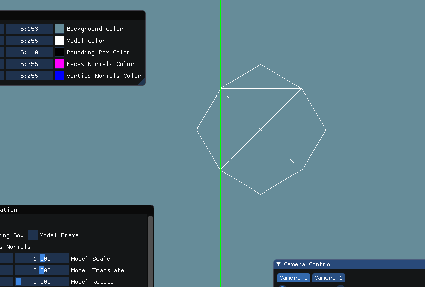

### Model Axes 
    
We defined each model four points to describe the local frame:
```cpp
// Keep the frame of the model
glm::vec3 Origin, AxisX, AxisY, AxisZ;
```

To draw the frame of the model, we calculates the center of the model by getting the average on each axis,
and calculate end points of each axis.
```cpp
auto minMax = GetMinMax(vertices);
	
	// ((maxX - minxX) / 2, (maxY - minxX) / 2, (maxZ - minxZ) / 2)
	Origin = glm::vec3((std::get<0>(minMax.second) + std::get<0>(minMax.first)) / 2, 
		(std::get<1>(minMax.second) + std::get<1>(minMax.first)) / 2,
		(std::get<2>(minMax.second) + std::get<2>(minMax.first)) / 2);

	// (maxX, (maxY - minxX) / 2, (maxZ - minxZ) / 2)
	AxisX = glm::vec3(std::get<0>(minMax.second),
		(std::get<1>(minMax.second) + std::get<1>(minMax.first)) / 2,
		(std::get<2>(minMax.second) + std::get<2>(minMax.first)) / 2);

	// ((maxX - minxX) / 2, maxY, (maxZ - minxZ) / 2)
	AxisY = glm::vec3((std::get<0>(minMax.second) + std::get<0>(minMax.first)) / 2,
		std::get<1>(minMax.second),
		(std::get<2>(minMax.second) + std::get<2>(minMax.first)) / 2);

	// ((maxX - minxX) / 2, (maxY - minxX) / 2, maxZ)
	AxisZ = glm::vec3((std::get<0>(minMax.second) + std::get<0>(minMax.first)) / 2,
		(std::get<1>(minMax.second) + std::get<1>(minMax.first)) / 2,
		std::get<2>(minMax.second));
```
Transforming in world frame:

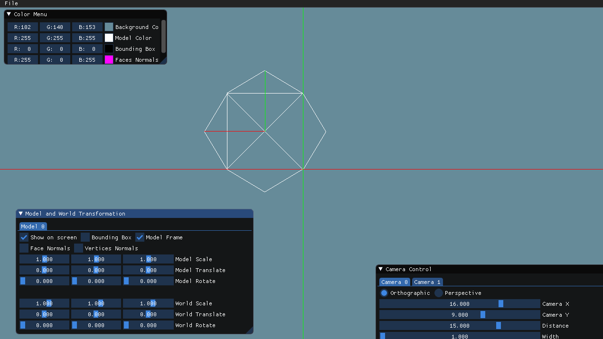

Transforming in model frame:

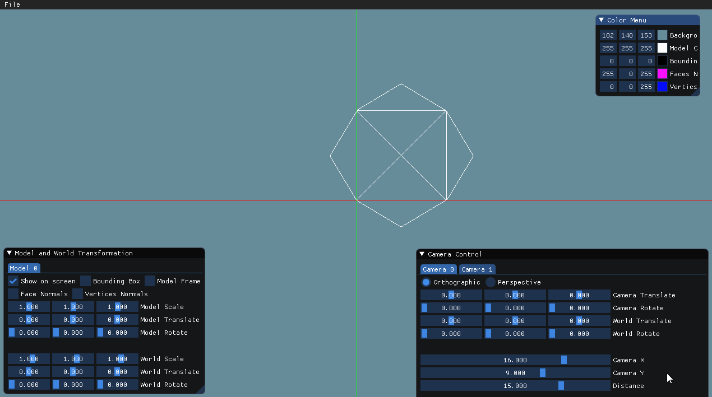

## 4 - Non-Commuting transformations

We used these transformations:
- `T1`: `ScaleX` by `2.747`
- `T2`: `TranslateX` by `-3.846`

When applying `T1` in model frame, and then `T2` in world frame:

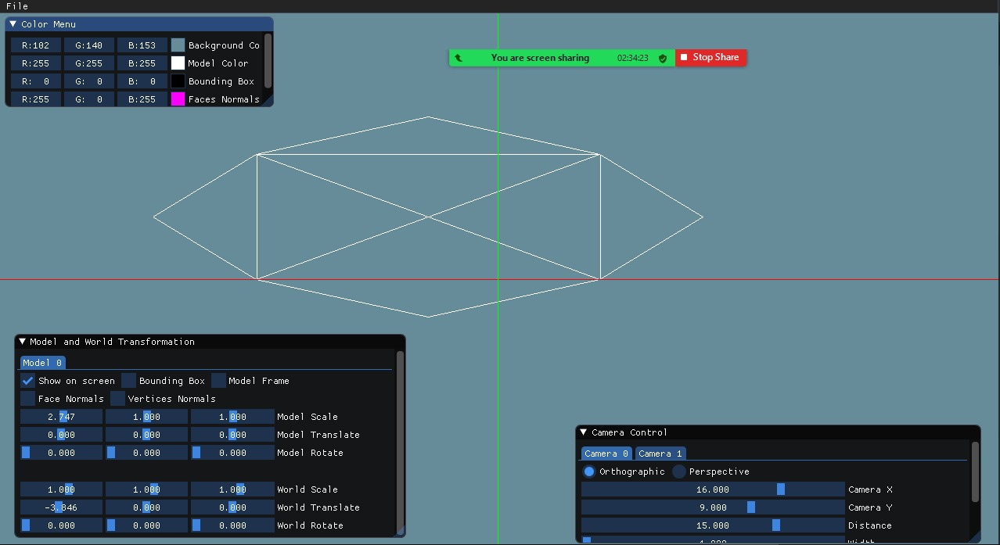

When applying `T2` in model frame, and then `T1` in world frame:

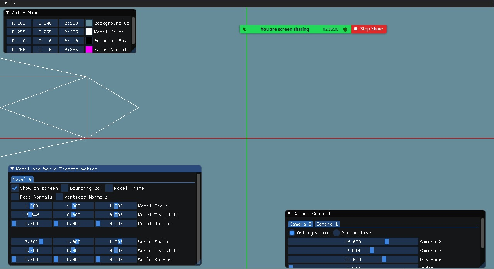

## 5 - Bounding Box and Normals

### Bounding Box
In order to draw the model's bounding box, we calculated the minimum and maximum
values of each axis in the model.

Then, we can easily draw the box:
1. `(minX, minY, minZ)`
2. `(minX, minY, maxZ)`
3. `(minX, maxY, minZ)`
4. `(minX, maxY, maxZ)`
5. `(maxX, minY, minZ)`
6. `(maxX, minY, maxZ)`
7. `(maxX, maxY, minZ)`
8. `(maxX, maxY, maxZ)`

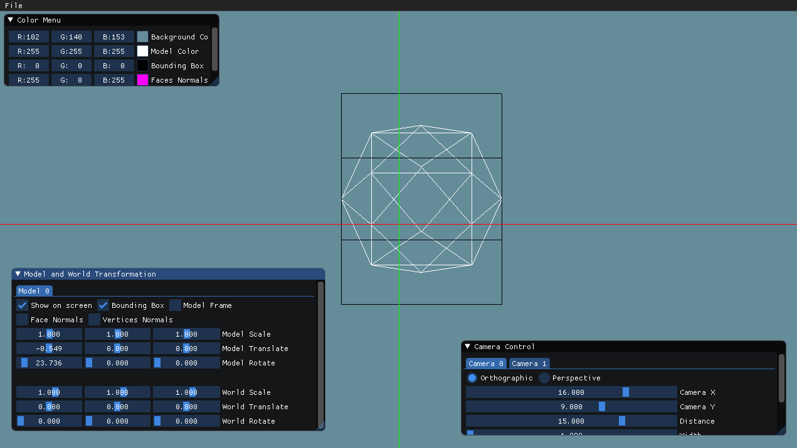

### Face Normals
We calculated the center of each face:
```cpp
glm::vec3 p1 = GetVertice(face.GetVertexIndex(0) - 1),
		p2 = GetVertice(face.GetVertexIndex(1) - 1),
		p3 = GetVertice(face.GetVertexIndex(2) - 1);

return glm::vec3((p1.x + p2.x + p3.x) / 3, (p1.y + p2.y + p3.y) / 3, (p1.z + p2.z + p3.z) / 3);
```

And then we calculated the vector that is perpendicular to the face at the center point:
```cpp
glm::vec3 point1 = GetVertice(GetFace(index).GetVertexIndex(1) - 1) - GetVertice(GetFace(index).GetVertexIndex(0) - 1);
glm::vec3 point2 = GetVertice(GetFace(index).GetVertexIndex(2) - 1) - GetVertice(GetFace(index).GetVertexIndex(0) - 1);
glm::vec3 normal = glm::normalize(glm::cross(point1, point2));
```
Finally, we draw a line between those points.

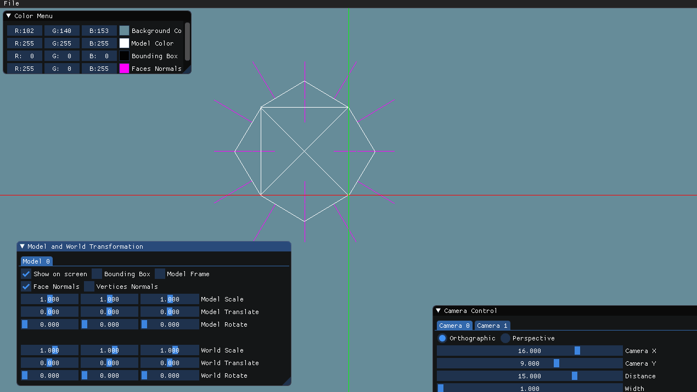

### Vertices Normals
We simply draw a line between each vertex and its normal on each face:
```cpp
for (int i = 0; i < model.GetFacesCount(); i++)
{
	Face currFace = model.GetFace(i);

	for (int j = 0; j < 3; j++)
	{
		glm::vec3 vertex = model.GetVertice(currFace.GetVertexIndex(j) - 1);
		glm::vec3 normal = model.GetNormal(currFace.GetNormalIndex(j) - 1) + vertex;
		DrawLine(TransVector(vertex, model, camera), TransVector(normal, model, camera), model.VerticsNormalsColor);
	}
}
```
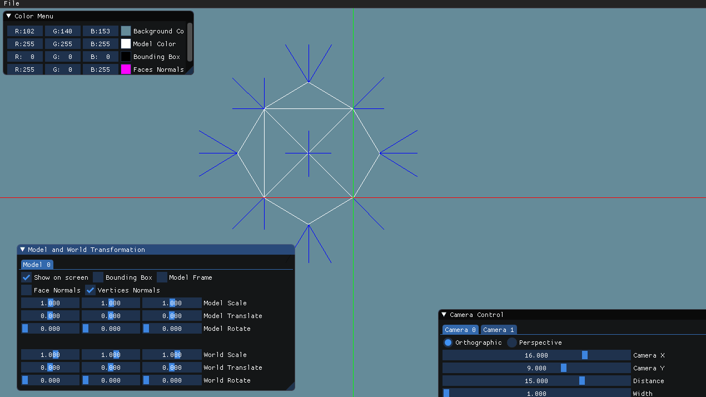

## 6 - Perspective Projection
We implemented a perspective projection using the normalized view volume matrix:

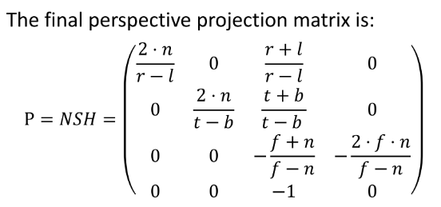

Let's compare the projections:

**Orthographic projection**:

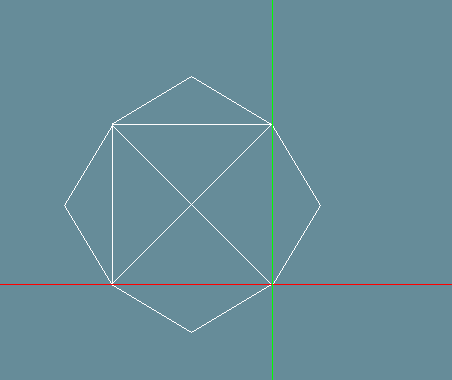

**Perspective projection**:

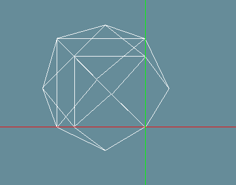

## 7 - Zoom and Distance

Distance:

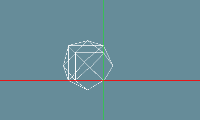

Frustum:

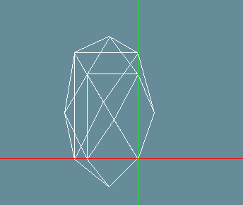

## 8 - World Frame VS Camera Frame
## Camera Frame
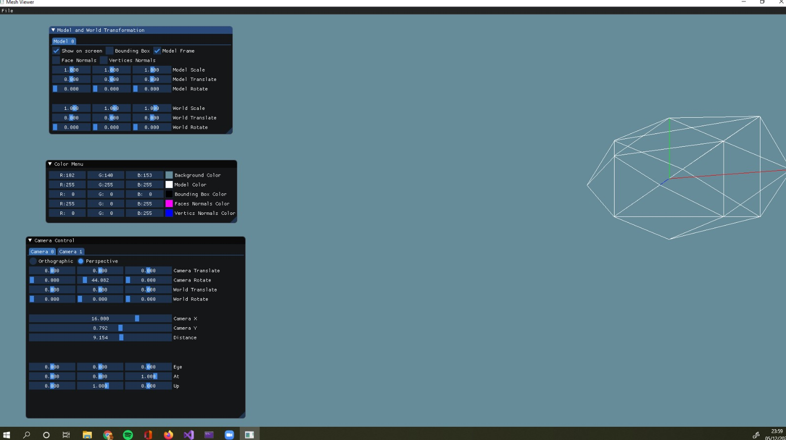
## World Frame
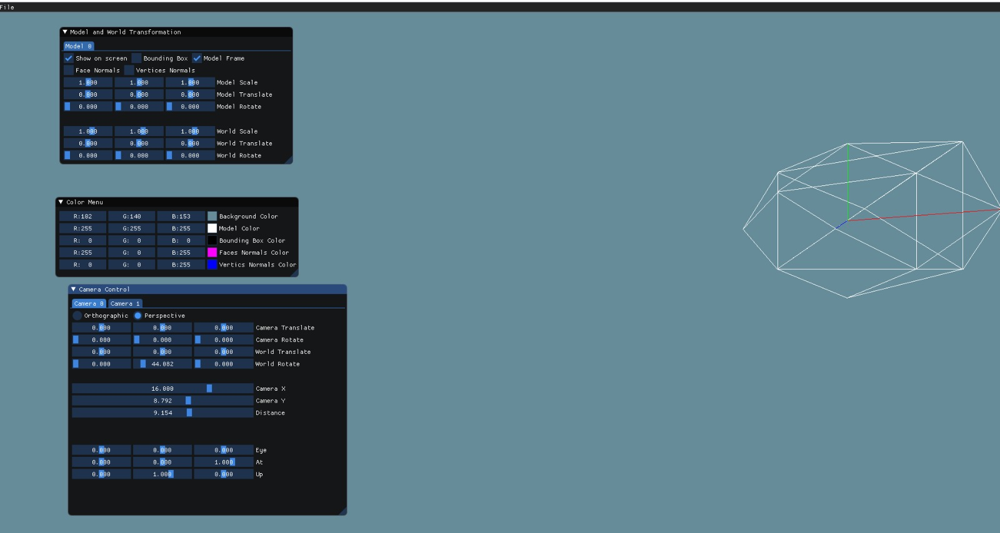

## 9 - Set Camera position

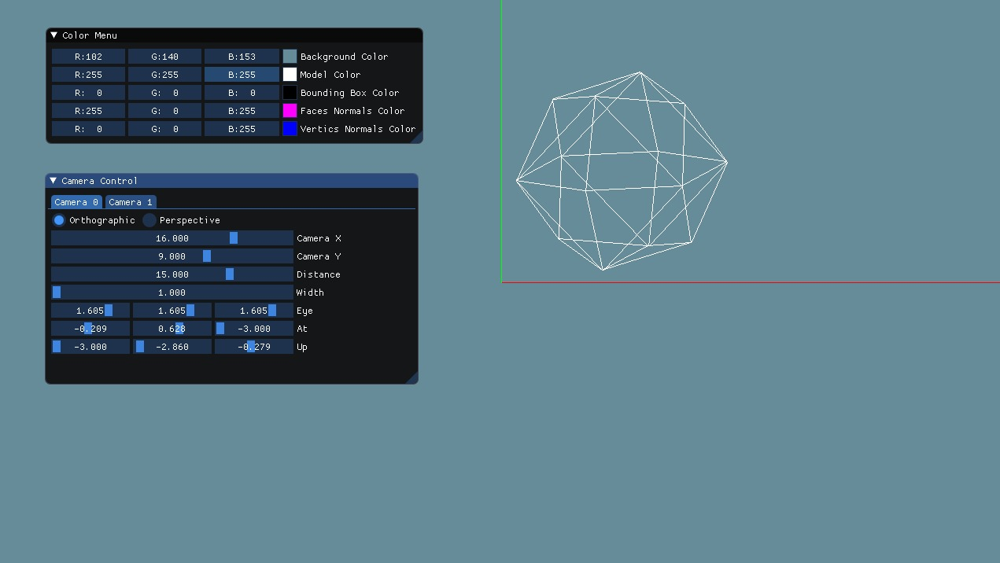

## 10 - Incremental tranformation
We added keyboard control that increments the camera when pressing `'U'`


## 11 - Multiple models and cameras
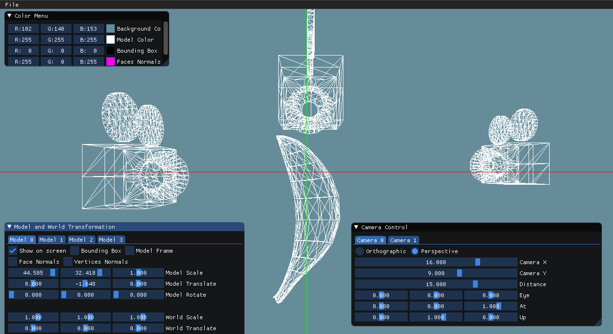

## 12 - GUI
### Color Menu:
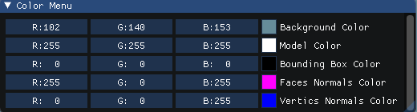

### Camera Control:
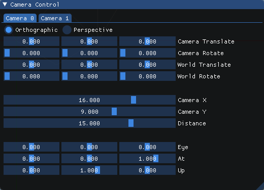

### Model Control
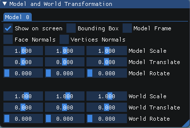

## 13 - Additional features

We added the option to choose colors for:
- Model
- Bounding Box
- Faces Normals
- Vertices Normals

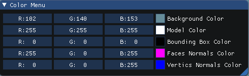

In addition, we added checkboxes to toggle the following:
- Show model on screen
- Model Frame axes
- Normlas per face
- Normals per vertex
- Bounding box

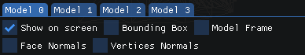

## The E.N.D

