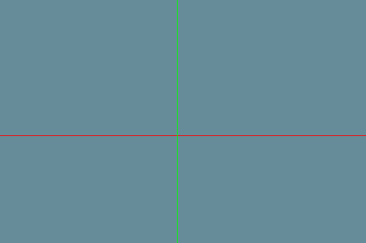

# Assignment 1 - Part 3
*Shahar Tefler & Iris Berger*

### 1 - Orthographic Projection
We removed the centring trick implemented in the previous assignment, and used viewport transformation in order to place the model at the center of the screen.


- The `CameraX` is the `left` and `right` parameters (symetrically).
- The `CameraY` is the `bottom` and `top` parameters (symetrically).
- The `Distance` is the `near` and `far` parameters (symetrically).

Let's see the result using different view volumes:


### 3 - Axes of model and world
- *World Axes*

    The origin is at the center: `(width / 2, height / 2)`

    The `AxisX` has 2 enpoints: 0, width
    So does `AxisY` and `AxisZ`

    

- *Model Axes*
    
    We defined each model four points to describe the local frame:
    
    ```cpp
    // Keep the frame of the model
	glm::vec3 Origin, AxisX, AxisY, AxisZ;
    ```

    To draw the frame of the model, we calculates the center of the model by getting the average on each axis,
	and calculate end points of each axis.
	```cpp
	auto minMax = GetMinMax(vertices);
	
		// ((maxX - minxX) / 2, (maxY - minxX) / 2, (maxZ - minxZ) / 2)
		Origin = glm::vec3((std::get<0>(minMax.second) + std::get<0>(minMax.first)) / 2, 
			(std::get<1>(minMax.second) + std::get<1>(minMax.first)) / 2,
			(std::get<2>(minMax.second) + std::get<2>(minMax.first)) / 2);

		// (maxX, (maxY - minxX) / 2, (maxZ - minxZ) / 2)
		AxisX = glm::vec3(std::get<0>(minMax.second),
			(std::get<1>(minMax.second) + std::get<1>(minMax.first)) / 2,
			(std::get<2>(minMax.second) + std::get<2>(minMax.first)) / 2);

		// ((maxX - minxX) / 2, maxY, (maxZ - minxZ) / 2)
		AxisY = glm::vec3((std::get<0>(minMax.second) + std::get<0>(minMax.first)) / 2,
			std::get<1>(minMax.second),
			(std::get<2>(minMax.second) + std::get<2>(minMax.first)) / 2);

		// ((maxX - minxX) / 2, (maxY - minxX) / 2, maxZ)
		AxisZ = glm::vec3((std::get<0>(minMax.second) + std::get<0>(minMax.first)) / 2,
			(std::get<1>(minMax.second) + std::get<1>(minMax.first)) / 2,
			std::get<2>(minMax.second));
	```
Transforming in world frame:


Transforming in model frame:


