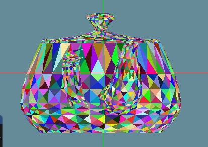

# Assignment 2 - Part 1
Shahar Tefler & Iris Berger

## Bounding Rectangles per Face
### Drawing the bounding rectangle
We drew the bounding box around each face the same as the bounding box of the model (except the z-axis):

```cpp
std::vector<glm::vec3> MeshModel::GetBoundingRectangle(std::vector<glm::vec3> vectors) const
{
	auto minMax = GetMinMax(vectors);
	std::vector<glm::vec3> points;

	glm::vec3 p1(std::get<0>(minMax.first), std::get<1>(minMax.second), std::get<2>(minMax.first));
	glm::vec3 p2(std::get<0>(minMax.second), std::get<1>(minMax.second), std::get<2>(minMax.first));
	glm::vec3 p3(std::get<0>(minMax.second), std::get<1>(minMax.first), std::get<2>(minMax.first));
	glm::vec3 p4(std::get<0>(minMax.first), std::get<1>(minMax.first), std::get<2>(minMax.first));

	points.push_back(p1);
	points.push_back(p2);
	points.push_back(p3);
	points.push_back(p4);

	return points;
}
```


### Drawing with diferent colors
We created a function that returnes a random color, and then, drew each bounding rectangle
with a random color:

```cpp
void Renderer::DrawBoundingRectangle(const MeshModel& model, const Camera& camera, const Face& face)
{
	std::vector<glm::vec3> transformedVecs;
	for (int i = 0; i < 3; i++)
	{
		transformedVecs.push_back(TransVector(model.GetVertice(face.GetVertexIndex(i) - 1), model, camera));
	}

	auto rectanglePoints = model.GetBoundingRectangle(transformedVecs);
	glm::vec3 randColor = Utils::GenerateRandomColor();
	DrawLine(rectanglePoints[0], rectanglePoints[1], randColor);
	DrawLine(rectanglePoints[1], rectanglePoints[2], randColor);
	DrawLine(rectanglePoints[2], rectanglePoints[3], randColor);
	DrawLine(rectanglePoints[3], rectanglePoints[0], randColor);
}
```


The result:


## Edge Walking
### The Algorithm

We decided to implement the edge walking algorithm. 
Using this algorithm, we want to find for each point whether it is inside the triangle or not. 


We created the `EdgeFunction` function:
- Input:
  - Two points that form a triangle edge
  - Point
- Output:
  - Negative value: If the point is on the left of the line
  - Positive value: If the point is on the left of the line
  - Zero: If the point is on the edge

```cpp
float Renderer::EdgeFunction(glm::vec3 v1, glm::vec3 v2, glm::vec3 p)
{
	return (p.x - v1.x) * (v2.y - v1.y) - (p.y - v1.y) * (v2.x - v1.x);
}
```

Now we need to check whether a given point is inside a triangle. 
We created the `Overlaps` function:

- Input:
  - vertices of the triangle
  - input point
- Output:
  - Whether the point is inside the triangle


From the three given vertices, we can find the triangle's edges. 
Then, using the first function we mentioned, we can decide if the given point is inside the 
triangle by checking if the value is positive or if the point is on the left triangle's edge. 

```cpp
bool Renderer::Overlaps(const glm::vec3 v1, const glm::vec3 v2, const glm::vec3 v3, const glm::vec3 point)
{
	bool doesOverlap = true;

	std::vector<float> isLeft;
	isLeft.push_back(EdgeFunction(v2, v3, point));
	isLeft.push_back(EdgeFunction(v3, v1, point));
	isLeft.push_back(EdgeFunction(v1, v2, point));

	// Get edges of triangles
	std::vector<glm::vec3> edges;
	edges.push_back(v3 - v2);
	edges.push_back(v1 - v3);
	edges.push_back(v2 - v1);

	for (int i = 0; i < 3; i++)
	{
		if (isLeft[i])
		{
			doesOverlap &= isLeft[i] > 0;
		}
		else
		{
			// Check if the edge is a left edge or top edge
			doesOverlap &= (edges[i].y == 0 && edges[i].x > 0) || (edges[i].y > 0);
		}
	}

	return doesOverlap;
}
```

Now, all that's left to do is to start painting all the model's faces. 
We paint the faces by going over each face in the model, and coloring every pixel inside the face.
 
Next, We find the right pixels to paint: 
We loop over all the pixels in the face's bounding rectangle (mentioned in section 1), 
and color a pixel only if it's inside the face (we can check it using the overlap function)


```cpp
void Renderer::EdgeWalking(const Face& face, const MeshModel& model, const Camera& camera, const glm::vec3 color)
{
	std::vector<glm::vec3> transformedVecs;
	for (int i = 0; i < 3; i++)
	{
		transformedVecs.push_back(TransVector(model.GetVertice(face.GetVertexIndex(i) - 1), model, camera));
	}

	auto boundingRect = model.GetBoundingRectangle(transformedVecs);
	for (int i = boundingRect[0].x; i <= boundingRect[1].x; i++)
	{
		for (int j = boundingRect[2].y; j <= boundingRect[1].y; j++)
		{
			glm::vec3 currPoint(i, j, 0);
			if (Overlaps(transformedVecs[0], transformedVecs[1], transformedVecs[2], currPoint))
			{
				PutPixel(i, j, color);
			}
		}
	}
}
```

Each face gets a different random color, which the function gets from the DrawFace function in Renderer.

The result:


## Z-buffer
### The Algorithm

This algorithm draws pixels on the screen according to their depth. 

We create a buffer that is the size of the image. 
For each pixel, we calculate the pixel's depth by performing linear interpolation with baycentric coordinates:


cpp


If the current pixel is the closest of all objects (its Z coordinate is less the in the zBuffer), 
we update the Z-Buffer, and draw the pixel. Otherwise, we do nothing :)

We added the Z-buffer logic to the `PutPixel` function, since it updates the color buffer.

```cpp
void Renderer::PutPixel(int i, int j, const glm::vec3& color, int z = 0)
{
	if (i < 0) return; if (i >= viewport_width) return;
	if (j < 0) return; if (j >= viewport_height) return;

	if (zBuffer[i][j] > z)
	{
		color_buffer[INDEX(viewport_width, i, j, 0)] = color.x;
		color_buffer[INDEX(viewport_width, i, j, 1)] = color.y;
		color_buffer[INDEX(viewport_width, i, j, 2)] = color.z;
		zBuffer[i][j] = z;
	}
}
```


We also compute the depth of each pixel that is inside the face in `EdgeWalking`, and pass it to `PutPixel`.

```cpp
void Renderer::EdgeWalking(const Face& face, const MeshModel& model, const Camera& camera, const glm::vec3 color)
{
	std::vector<glm::vec3> transformedVecs;
	for (int i = 0; i < 3; i++)
	{
		transformedVecs.push_back(TransVector(model.GetVertice(face.GetVertexIndex(i) - 1), model, camera));
	}

	auto boundingRect = model.GetBoundingRectangle(transformedVecs);
	for (int i = boundingRect[0].x; i < boundingRect[1].x; i++)
	{
		for (int j = boundingRect[2].y; j < boundingRect[1].y; j++)
		{
			glm::vec3 currPoint(i, j, 0);
			if (Overlaps(transformedVecs[0], transformedVecs[1], transformedVecs[2], currPoint))
			{
				float z = ComputeDepth(transformedVecs[0], transformedVecs[1], transformedVecs[2], glm::vec2(i, j));
				PutPixel(i, j, color, z);
			}
		}
	}
}
```


The result:

| Without Z-Buffer      | With Z-Buffer |
| ----------- | ----------- |
|     |        |
|     |        |


## fin
This is a tradition by now
