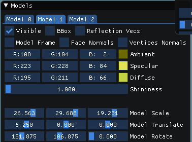
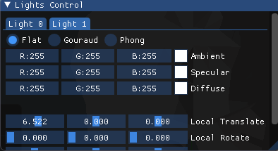
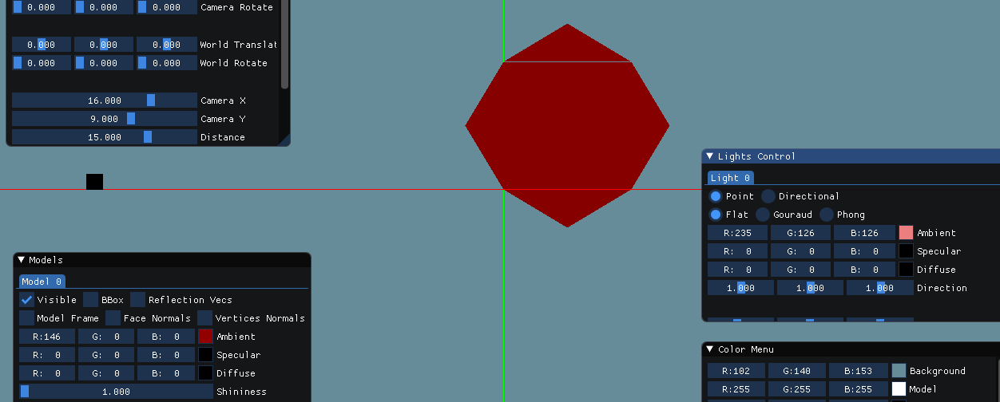
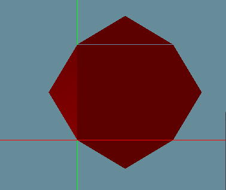
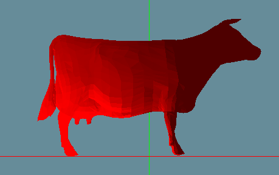
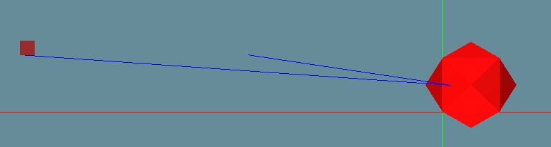
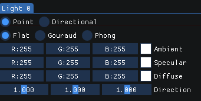
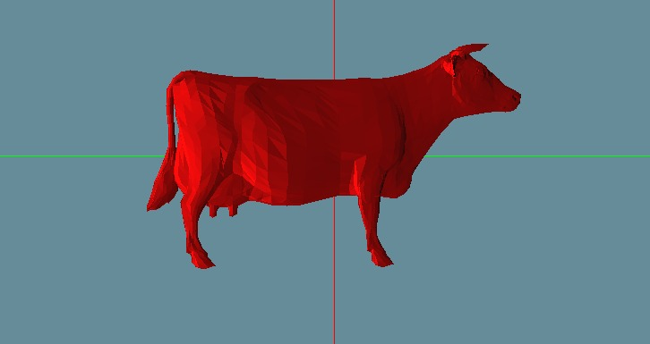
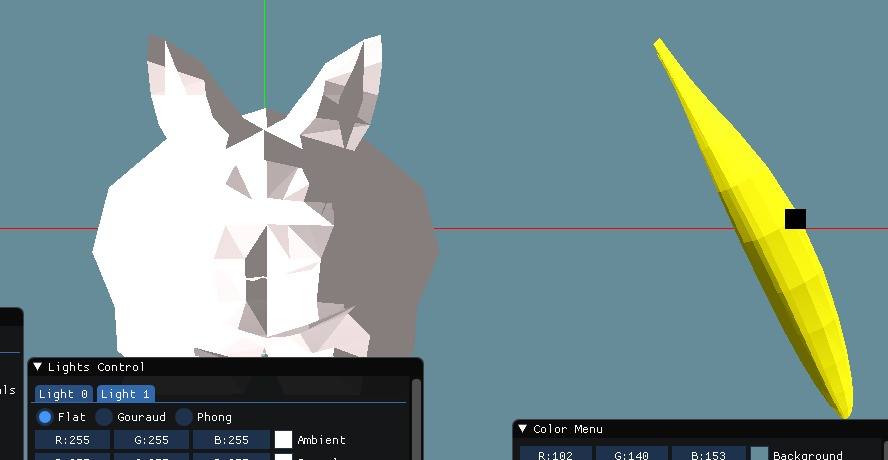
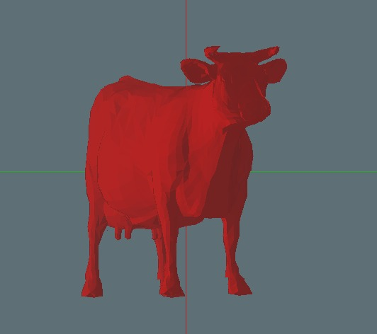

# Assignment 2 - Part 2
Shahar Tefler & Iris Berger

## 1 - Ambient Light and GUI controls
### GUI

For starters, we added a class to describe a light point. It holds the source point, lighting type.

We added GUI options to move the light, and change colors:




Ambient color only:



Ambient color has a uniform color for all faces, the color is the additive
result of both colors seen in the picture above (light and model).


## 2 - Diffuse Light + Flat Shading
According to the PHong Reflection Model:

In Flat shading we calculate the shade of each polygon of the model, using:
* The angle between the face's normal and the light direction
* Light's color
* Model's material color

Because we use face normals, each face has its own color, AKA, Flat Shading.
We can see that in this shading the transition of the color is not smooth (we can see some of the faces lines).

```cpp
glm::vec3 Renderer::FlatShading(const MeshModel& model, const Light& light, const Camera& camera, const Face& face, const glm::vec3& point, const int& index)
{
	// In flat shading, we use normal per face
	glm::vec3 normal = model.GetFaceNormal(index) + model.GetFaceCenter(face);
	return GetVertexColor(model, light, camera, face, point, ApplyTrans(normal, model.GetTransformation()));
}
```

In diffuse light we have a light source. when the light touches the surface the ligth
Then the light reflected from it.

We can see that the position of the light source changes the amount of light reflected from the surface.

Ambient:


Diffuse:



```cpp
glm::vec3 Light::CalcDiffuseReflection(const glm::vec3& color, const glm::vec3& normal, const glm::vec3& lightDirection) const
{
	glm::vec3 res = Utils::AdditiveColor(color, DiffuseColor) * glm::dot(glm::normalize(lightDirection), glm::normalize(normal));

	if (res.x < 0)
	{
		res.x = 0;
	}
	if (res.y < 0)
	{
		res.y = 0;
	}
	if (res.z < 0)
	{
		res.z = 0;
	}
	return res;
}
```


## 3 - Gouraud shading
With gouraud shading we try to achieve smooth lighting for our model.

How do we implement the Gouraud shading?
For this shading we use the vertices normals. 
Every vertix can have several normals, so we average all of them into one normal.

Then, we calculate the color for each face vertix using the Phong Reflection model.
After getting the color for each vertix, we linearly interpolate (using baycentric ccordinates) the colors of the
vertices.

```cpp
glm::vec3 Renderer::GouraudShading(const MeshModel& model, const Light& light, const Camera& camera, const Face& face, const glm::vec3& point, const int& index)
{
	std::vector<glm::vec3> verticesColors;
	std::vector<glm::vec3> vertices;
	/* Get colors of all face vertices, based on lighting type */
	for (int i = 0; i < 3; i++)
	{
		vertices.push_back(TransVector(model.GetVertice(face.GetVertexIndex(i) - 1), model, camera));
		glm::vec3 normal = model.GetNormalVertix(face.GetVertexIndex(i));
		normal = TransVector((normal + model.GetVertice(face.GetVertexIndex(i) - 1)), model, camera);
		normal = normal - vertices[i];
		verticesColors.push_back(GetVertexColor(model, light, camera, face, vertices[i], normal));
	}

	/* Use baycentric coordinates to linearly interpolate the colors of the vertices */
	float area1 = Utils::CalcTriangleArea(vertices[1], vertices[2], point),
		area2 = Utils::CalcTriangleArea(vertices[0], vertices[2], point),
		area3 = Utils::CalcTriangleArea(vertices[0], vertices[1], point);
	float area = area1 + area2 + area3;

	return (area1 / area) * verticesColors[0] + (area2 / area) * verticesColors[1] + (area3 / area) * verticesColors[2];
}
```

We can see that in this shading, the transition of the colors are much smoother than in the flat shading.

Grouraud image:


Flat Shading:




## 4 - Reflection vectors
In specular light, the reflection vector is the vector reflected from the face, with the same angle
the light ray hit it with.

So, we used the normal to reflect the light direction, and drew a line from the face's center to it.



## 5 - Specular Light + Phong Shading
Specular light is only making the mobel surfaces looke brilliant. 
In this case if you are closer to the camera the direction of the reflection will be seen in high intensity
More.

Phong shading is a per-fragment color computation. 
The vertex shader provides the normal and position data as out variables to the fragment shader. 
The fragment shader then interpolates these variables and computes the color.

```cpp
glm::vec3 Renderer::PhongShading(const MeshModel& model, const Light& light, const Camera& camera, const Face& face, const glm::vec3& point, const int& index)
{
	std::vector<glm::vec3> normals;
	std::vector<glm::vec3> vertices;
	/* Get colors of all face vertices, based on lighting type */
	for (int i = 0; i < 3; i++)
	{
		vertices.push_back(TransVector(model.GetVertice(face.GetVertexIndex(i) - 1), model, camera));
		glm::vec3 normal = model.GetNormalVertix(face.GetVertexIndex(i) - 1);
		normal = TransVector((normal + model.GetVertice(face.GetVertexIndex(i) - 1)), model, camera);
		normal = normal - vertices[i];
		normals.push_back(normal);
	}

	/* Use baycentric coordinates to linearly interpolate the normals */
	float area1 = Utils::CalcTriangleArea(vertices[1], vertices[2], point),
		area2 = Utils::CalcTriangleArea(vertices[0], vertices[2], point),
		area3 = Utils::CalcTriangleArea(vertices[0], vertices[1], point);
	float area = area1 + area2 + area3;
	glm::vec3 normal = glm::normalize((area1 / area) * normals[0] + (area2 / area) * normals[1] + (area3 / area) * normals[2]);
	return GetVertexColor(model, light, camera, face, point, normal);
}
``` 


## 6 - Directional Light
A directional light only has a direction, and not a real source because it comes from everywhere.

We added a direction vector to the light object, and allowed the user to control it:





## 7 - Results

Behold!!!



Imagine that the banana is a carrot :)

## 8 - Post Processing
We decided to add fog effect. It works in the following way:

We calculate distance from each pixel to the zBuffer. 
Then, we would like to change the color of the far pixels to be darker.

So, we divide the color by the distance, so that, the bigger the distance, the lower (darkest) the color is.

```cpp
void Renderer::ApplyFogEffect(float fogStart, float fogEnd, const Camera& camera)
{
	float pixelDistance;
	float fogDistance;
	for (int i = 0; i < viewport_width; i++)
	{
		for (int j = 0; j < viewport_height; j++)
		{
			pixelDistance = glm::distance(camera.getEye(), glm::vec3(i, j, zBuffer[i][j]));
			fogDistance = glm::clamp((fogStart - pixelDistance) / (fogStart - fogStart), 0.0f, 1.0f);
			color_buffer[INDEX(viewport_width, i, j, 0)] = glm::clamp(fogDistance * color_buffer[INDEX(viewport_width, i, j, 0)] + (1 - fogDistance) * scene.fogColor, 0.0f, 1.0f)[0];
			color_buffer[INDEX(viewport_width, i, j, 1)] = glm::clamp(fogDistance * color_buffer[INDEX(viewport_width, i, j, 1)] + (1 - fogDistance) * scene.fogColor, 0.0f, 1.0f)[1];
			color_buffer[INDEX(viewport_width, i, j, 2)] = glm::clamp(fogDistance * color_buffer[INDEX(viewport_width, i, j, 2)] + (1 - fogDistance) * scene.fogColor, 0.0f, 1.0f)[2];
		}
	}
}
```



## E.N.D
We don't have any more ideas to say: The END of the report.

The office is pretty good, so we'll stick with it:

