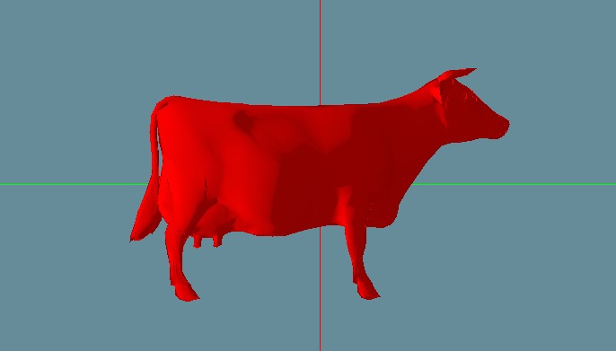

# Assignment 2 - Part 2
Shahar Tefler & Iris Berger

## 1 - Ambient Light and GUI controls
### GUI
For starters, we added a class to describe a light point. It holds the source point.


## 2 - Diffuse Light + Flat Shading
According to the PHong Reflection Model:

In Flat shading we calculate the shade of each polygon of the model, using:
* The angle between the face's normal and the light direction
* Light's color
* Model's material color

Because we use face normals, each face has its own color, AKA, Flat Shading.
We can see that in this shading the transition of the color is not smooth (we can see some of the faces lines).

```cpp
glm::vec3 Renderer::FlatShading(const MeshModel& model, const Light& light, const Camera& camera, const Face& face, const glm::vec3& point, const int& index)
{
	// In flat shading, we use normal per face
	glm::vec3 normal = model.GetFaceNormal(index) + model.GetFaceCenter(face);
	return GetVertexColor(model, light, camera, face, point, ApplyTrans(normal, model.GetTransformation()));
}
```


In diffuse light we have a light source. when the light touches the surface the ligth
Then the light reflected from it.
We can see that the position of the light source changes the amount of light reflected from the surface.

```cpp
glm::vec3 Light::CalcDiffuseReflection(const glm::vec3& color, const glm::vec3& normal, const glm::vec3& lightDirection) const
{
	glm::vec3 res = Utils::AdditiveColor(color, DiffuseColor) * glm::dot(glm::normalize(lightDirection), glm::normalize(normal));

	if (res.x < 0)
	{
		res.x = 0;
	}
	if (res.y < 0)
	{
		res.y = 0;
	}
	if (res.z < 0)
	{
		res.z = 0;
	}
	return res;
}
```

## 3 - Gouraud shading
With gouraud ahsding we tring to achieve smooth lighting for our model.

How we implement the Gouraud shading?
For this shading we ouse the vertix normals. 
Every vertix can have several normal so we do an interpolation on all of the to find only one normal.


```cpp
glm::vec3 Renderer::GouraudShading(const MeshModel& model, const Light& light, const Camera& camera, const Face& face, const glm::vec3& point, const int& index)
{
	std::vector<glm::vec3> verticesColors;
	std::vector<glm::vec3> vertices;
	/* Get colors of all face vertices, based on lighting type */
	for (int i = 0; i < 3; i++)
	{
		vertices.push_back(TransVector(model.GetVertice(face.GetVertexIndex(i) - 1), model, camera));
		glm::vec3 normal = model.GetNormalVertix(face.GetVertexIndex(i));
		normal = TransVector((normal + model.GetVertice(face.GetVertexIndex(i) - 1)), model, camera);
		normal = normal - vertices[i];
		verticesColors.push_back(GetVertexColor(model, light, camera, face, vertices[i], normal));
	}

	/* Use baycentric coordinates to linearly interpolate the colors of the vertices */
	float area1 = Utils::CalcTriangleArea(vertices[1], vertices[2], point),
		area2 = Utils::CalcTriangleArea(vertices[0], vertices[2], point),
		area3 = Utils::CalcTriangleArea(vertices[0], vertices[1], point);
	float area = area1 + area2 + area3;

	return (area1 / area) * verticesColors[0] + (area2 / area) * verticesColors[1] + (area3 / area) * verticesColors[2];
}
```

We can see that in this shading the transition of the colors are mash more smoother than in the flat shading.

Grouraud image:


Flat Shading:


## 4 - 

## 5 - Specular Light + Phong Shading
Specular light is only making the mobel surfaces looke brilliant. 
In this case if you are closer to the camera the direction of the reflection will be seen in high intensity
More.

Phong shading is a per-fragment color computation. 
The vertex shader provides the normal and position data as out variables to the fragment shader. 
The fragment shader then interpolates these variables and computes the color.

```cpp
glm::vec3 Renderer::PhongShading(const MeshModel& model, const Light& light, const Camera& camera, const Face& face, const glm::vec3& point, const int& index)
{
	std::vector<glm::vec3> normals;
	std::vector<glm::vec3> vertices;
	/* Get colors of all face vertices, based on lighting type */
	for (int i = 0; i < 3; i++)
	{
		vertices.push_back(TransVector(model.GetVertice(face.GetVertexIndex(i) - 1), model, camera));
		glm::vec3 normal = model.GetNormalVertix(face.GetVertexIndex(i) - 1);
		normal = TransVector((normal + model.GetVertice(face.GetVertexIndex(i) - 1)), model, camera);
		normal = normal - vertices[i];
		normals.push_back(normal);
	}

	/* Use baycentric coordinates to linearly interpolate the normals */
	float area1 = Utils::CalcTriangleArea(vertices[1], vertices[2], point),
		area2 = Utils::CalcTriangleArea(vertices[0], vertices[2], point),
		area3 = Utils::CalcTriangleArea(vertices[0], vertices[1], point);
	float area = area1 + area2 + area3;
	glm::vec3 normal = glm::normalize((area1 / area) * normals[0] + (area2 / area) * normals[1] + (area3 / area) * normals[2]);
	return GetVertexColor(model, light, camera, face, point, normal);
}
``` 



## 6 - Directional Light


## 7 - Results


## 8 - Post Processing

## fin
This is a tradition by now:

