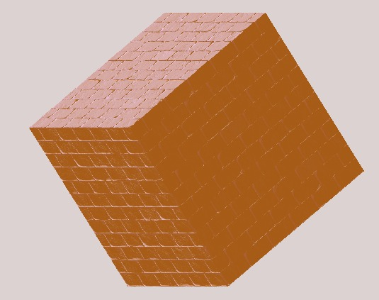

# Assignment 3
Shahar Tefler & Iris Berger

## 1 - InitOpenGLRendering()
The function maps the texture over the screen.
We assign screen coordinates as 2 triangles, with the following coordinates:

```cpp
// (-1, 1)___(1, 1)
//       |\  |
//       | \ | <--- The texture is drawn over two triangles that stretch over the screen.
//       |__\|
// (-1,-1)   (1,-1)
```

Then, we define the coordinates of the texture:

```cpp
const GLfloat tex[] = {
		0,0,
		1,0,
		0,1,
		0,1,
		1,0,
		1,1 };
```

Then, we bind both coordinate buffers to OpenGL, allocate space on the GPU
and copy the coordinate buffers there.

Now, we initialize the shader, and tell OpenGL to use it:

Finally, we pass the screen and texture coordinates to the shader.

This function is called once, upon initialization, and creates a mapping for the texture.

So the pipeline is as follows:

`InitOpenGLRendering` defines the mapping of a texture over the screen.

The `Render` function updates the color buffer, which is a buffer the size of the screen
which contatins a color for each pixel.

Right after `Render`, we call `SwapBuffers`, which converts the 
color buffer into a texture.

Finally, we get the color buffer as a texture over the screen.

## 2 - Load mesh on the GPU

Firstly, we need to create a shader which accepts vertexes, and outputs them.
```cpp
layout(location = 0) in vec3 pos;
layout(location = 1) in vec2 texCoords;

out vec2 texCoord;

void main()
{
    gl_Position.xyz = pos;
    gl_Position.z = 0;
    gl_Position.w = 1;
    texCoord = texCoords;
}
```

This basic shader outputs the homogenous coordinates, without depth.

Then, we need to pass the model's vertexs to the shader.

Firstly, we created struct for the layout inputs in the shader:
```cpp
struct Vertex
{
	glm::vec3 pos;
	glm::vec3 textureCoords;
};
```

Then, we created VAO and VBO in MeshModel for the vertexes, and specified
the offsets of the inputs in the layout:

```cpp
/* Initialize VAO and VBO for the vertexs */
glGenVertexArrays(1, &vao);
glGenBuffers(1, &vbo);

glBindVertexArray(vao);
glBindBuffer(GL_ARRAY_BUFFER, vbo);
glBufferData(GL_ARRAY_BUFFER, modelVertexes.size() * sizeof(Vertex), &modelVertexes[0], GL_STATIC_DRAW);

/* Initialize input positions of Vertex for shader */
glVertexAttribPointer(0, 3, GL_FLOAT, GL_FALSE, sizeof(Vertex), (GLvoid*)0);
glEnableVertexAttribArray(0);

glVertexAttribPointer(1, 2, GL_FLOAT, GL_FALSE, sizeof(Vertex), (GLvoid*)(3 * sizeof(GLfloat)));
glEnableVertexAttribArray(1);

glBindVertexArray(0)
```

Finally, we pass the vertexes in Renderer, and draw it wireframe:

```cpp
const Camera& camera = scene.GetCamera(scene.GetActiveCameraIndex());
	const Light& light = scene.GetLight(scene.GetActiveLightIndex());

	for (int i = 0; i < scene.GetModelCount(); i++)
	{
		MeshModel& currModel = scene.GetModel(i);
		if (currModel.gui.IsOnScreen)
		{
			vertexShader.use();
			texture.bind(0);

			glPolygonMode(GL_FRONT_AND_BACK, GL_LINE);
			glBindVertexArray(currModel.GetVAO());
			glDrawArrays(GL_TRIANGLES, 0, currModel.GetVerticesCount());
			glBindVertexArray(0);

			texture.unbind(0);
		}
	}
}
```
  
## 3 - Supporting transformations all over again :)
In order to support transformations, we need to pass the model's 
and camera's transformations (MVP) to the vertex shader.

As said in the lecture, we will pass it using uniforms. The shader now looks like this:

```cpp
#version 330 core

layout(location = 0) in vec3 pos;
layout(location = 1) in vec2 texCoords;

// MVP for transformations
uniform mat4 model;
uniform mat4 view;
uniform mat4 projection;

out vec2 texCoord;

void main()
{
    gl_Position = projection * view * model * vec4(pos, 1.0f);
}
```

Then, we need to pass the transformations as uniforms in the Render() function:

```cpp
const Camera& camera = scene.GetCamera(scene.GetActiveCameraIndex());
	const Light& light = scene.GetLight(scene.GetActiveLightIndex());

	for (int i = 0; i < scene.GetModelCount(); i++)
	{
		MeshModel& currModel = scene.GetModel(i);
		if (currModel.gui.IsOnScreen)
		{
			vertexShader.use();

			// Pass transformatins to shader (MVP)
			vertexShader.setUniform("model", currModel.GetTransformation());
			vertexShader.setUniform("view", camera.GetViewTransformation());
			vertexShader.setUniform("projection", camera.GetProjectionTransformation());

			texture.bind(0);

			glPolygonMode(GL_FRONT_AND_BACK, GL_LINE);
			glBindVertexArray(currModel.GetVAO());
			glDrawArrays(GL_TRIANGLES, 0, currModel.GetVerticesCount());
			glBindVertexArray(0);

			texture.unbind(0);
		}
	}
}
```

## 4 - Constant color in Fragment Shader
We created a super simple fragment shader, which only has one output:

```cpp
#version 330 core

out vec4 fColor;

void main() 
{ 
   fColor = vec4(0);
} 
```

It outputs constant black color for each pixel.

We also added drawing in fill mode, coloring the model:

```cpp
glPolygonMode(GL_FRONT_AND_BACK, GL_FILL);
glBindVertexArray(currModel.GetVAO());
glDrawArrays(GL_TRIANGLES, 0, currModel.GetVerticesCount());
glBindVertexArray(0);
```

## 5 - Update Renderer
We did it in the previous sections.

## 6 - Phong Shading
Phong shading needs the following parameters:
- Model's and Light's ambient, diffuse and specular colors
- Camera direction from point
- Light direction from point
- Specular's alpha

We passed the colors of the different lightings to the shader.

Since the fragment shader goes through every pixel, the camera and light direction should be calculated there.
So, we passed the positions of the light and the camera.

Here is the updated fragment shader:
```cpp
#version 330 core

struct Material
{
	sampler2D textureMap;
	vec3 ambientColor;
	vec3 diffuseColor;
	vec3 specularColor;
	float alpha;
};

struct Light
{
	vec3 ambientColor;
	vec3 diffuseColor;
	vec3 specularColor;

	vec3 source;
};

// We set this field's properties from the C++ code
uniform Material material;
uniform Light light;
uniform vec3 cameraPosition;

// Inputs from vertex shader (after interpolation was applied)
in vec3 fragPos;
in vec3 fragNormal;
in vec2 fragTexCoords;
in vec3 orig_fragPos;
// The final color of the fragment (pixel)
out vec4 frag_color;

void main()
{
	// Sample the texture-map at the UV coordinates given by 'fragTexCoords'
	vec3 textureColor = vec3(texture(material.textureMap, fragTexCoords));

	vec3 lightDirection = fragPos - light.source;
	vec3 cameraDirection = light.source - cameraPosition;

	vec3 ambient = light.ambientColor * material.ambientColor;
	vec3 diffuse = light.diffuseColor * material.diffuseColor * dot(normalize(lightDirection), normalize(fragNormal));

	vec3 lightReflection = reflect(normalize(lightDirection), normalize(fragNormal));
	float reflectionDegree = clamp(dot(lightReflection, normalize(cameraDirection)), 0.0f, 360.0f);
	float shininessFactor = pow(reflectionDegree, material.alpha);
	vec3 specular = light.specularColor * material.specularColor * shininessFactor; 

	frag_color = vec4(ambient + diffuse + specular, 1);
}

```
Then, we calculated each light type as we did in the previous assignment! Easy Peasy

Now, we need to pass these parameters in the renderer:

```cpp
vertexShader.setUniform("model", currModel->GetTransformation());
vertexShader.setUniform("view", camera.GetViewTransformation());
vertexShader.setUniform("projection", camera.GetProjectionTransformation());

vertexShader.setUniform("light.ambientColor", currLight->GetAmbientColor());
vertexShader.setUniform("light.diffuseColor", currLight->GetDiffuseColor());
vertexShader.setUniform("light.specularColor", currLight->GetSpecularColor());
vertexShader.setUniform("light.source", currLight->GetSource());

vertexShader.setUniform("material.ambientColor", currModel->gui.AmbientReflectionColor);
vertexShader.setUniform("material.diffuseColor", currModel->gui.DiffuseReflectionColor);
vertexShader.setUniform("material.specularColor", currModel->gui.SpecularReflectionColor);
vertexShader.setUniform("material.alpha", currModel->gui.shininess);

vertexShader.setUniform("cameraPosition", camera.getEye());
```


Here is a really beautiful pink/magneta (not purple :) ) with a bit of a blue light:


[So smooth!!!]

## 7 - Types of texture mapping
### Planar
In planar, we map the UV coordinates to be the same as the vertex's position, so:

```cpp
for (Vertex& vertex : modelVertices) {
	vertex.textureCoords = glm::vec2(vertex.position.x, vertex.position.y);
}
```

And we get the following:


### Cylindrical
In cylindrical, we map coordinates into their polar coordinates:

```cpp
float phi = std::atan2(vertex.position.x, vertex.position.y);
float theta = std::atan2(vertex.position.x, vertex.position.z);
vertex.textureCoords = glm::vec2(phi, theta);
```

We get the following:


### Spherical
Basically the same, we convert the coordinates to spherical coordinates:


```cpp
float r = glm::sqrt(vertex.position.x * vertex.position.x + vertex.position.y * vertex.position.y + vertex.position.z * vertex.position.z);
float theta = glm::atan(vertex.position.y / vertex.position.x);
float phi = glm::acos(vertex.position.z / r);

vertex.textureCoords.x = phi / 2 * glm::pi<float>();
vertex.textureCoords.y = 10.f - theta / glm::pi<float>();
```

And... We get this:


## NPR
### Normal Mapping

In normal mapping, we add a given 2D texture on a flat model that we have. 
For doing that we need to use the normals of every fragment. 

By using them we make the surface look like it was built from smaller parts, this gives the surface the opportunity to get a lot of detail.
For doing that we needed the TBN mattrix. 

We added this code to vShader:
```cpp
vec3 T = normalize(vec3( vec4(tangents, 1.0f)));
vec3 N = normalize(vec3( vec4(normal,1.0f)));
T = normalize(T - N * dot(N, T));
vec3 B = cross(N,T);
TBN = mat3(T, B, N);
```

And we added this code to fShader:
```cpp
vec3 Normal;
if(normalMapping)
{
	Normal = vec3(texture(material.normalMap, fragTexCoords).rgb * 2.0 - 1.0);  
	Normal = normalize((TBN) * Normal);
		
}
else
	Normal=fragNormal;
```

We get the following:

 

### Environment mapping

In environment mapping, we want to assign to the model the same color as the environment.

So firstly, we created a skybox - which is a cube with 6 faces, that makes it seem as a complete 360 image.


To load a skybox, we need to load each face, with `glTexImage2D`, which has a macro for cube map:

```cpp
glTexImage2D(GL_TEXTURE_CUBE_MAP_POSITIVE_X, 
                0, GL_RGB, width, height, 0, GL_RGB, GL_UNSIGNED_BYTE, data
);
glTexImage2D(GL_TEXTURE_CUBE_MAP_NEGATIVE_X, 
                0, GL_RGB, width, height, 0, GL_RGB, GL_UNSIGNED_BYTE, data
);

glTexImage2D(GL_TEXTURE_CUBE_MAP_POSITIVE_Y, 
                0, GL_RGB, width, height, 0, GL_RGB, GL_UNSIGNED_BYTE, data
);
glTexImage2D(GL_TEXTURE_CUBE_MAP_NEGATIVE_Y, 
                0, GL_RGB, width, height, 0, GL_RGB, GL_UNSIGNED_BYTE, data
);

glTexImage2D(GL_TEXTURE_CUBE_MAP_POSITIVE_Z, 
                0, GL_RGB, width, height, 0, GL_RGB, GL_UNSIGNED_BYTE, data
);
glTexImage2D(GL_TEXTURE_CUBE_MAP_NEGATIVE_Z, 
                0, GL_RGB, width, height, 0, GL_RGB, GL_UNSIGNED_BYTE, data
);
```

Then, we wanted to actually implement the reflection attribute. 

We need to reflect the camera direction vector according to the normal:


So, the fragment shader is like this:

```cpp
out vec4 FragColor;

in vec3 normal;
in vec3 position;

uniform vec3 cameraEye;
uniform samplerCube skybox;

void main()
{             
    vec3 cameraDirection = normalize(position - cameraEye);
    vec3 reflectionVec = reflect(cameraDirection, normalize(normal));
    FragColor = vec4(texture(skybox, reflectionVec).rgb, 1.0);
}
```

Result:


### Toon shading
In toon shading, we make 3D models to appear to be cartoonish by using less shading color instead of a varaity of tints and shades.

To implement this, we divided all the color shades into 4 colors, only by the intensity of the color at each point.

This is how we got the intensity:

```cpp
float intensity = dot(normalize(lightDirection), normalize(fragNormal));
```

We get the following:


## *fin*
Ah one last time:

Us when something works:


Us when we finished just one exercise out of 8:


