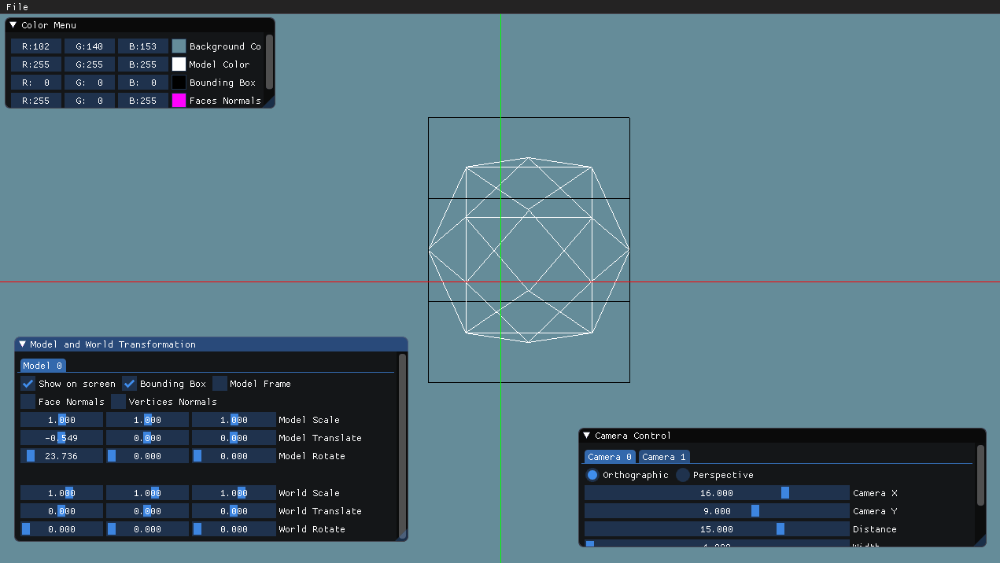
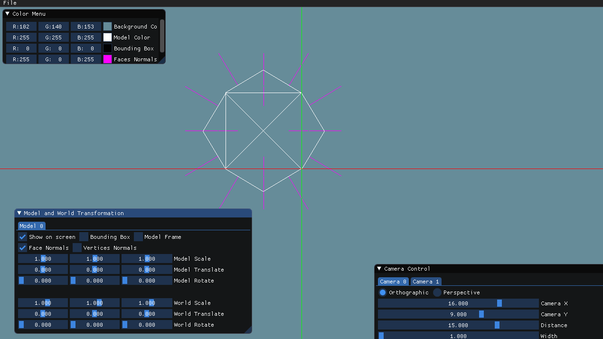
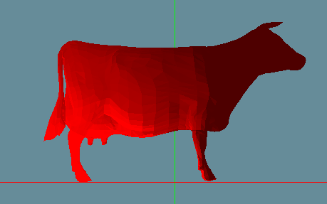
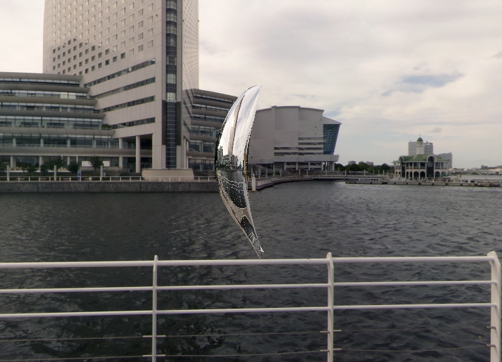

# Computer Graphics 203.3710
## Students Team data

Name: Shahar Tefler

Name: Iris Berger

### Lecturer

*Roi Poranne*

## Course Description

This course provides an introduction to the foundations of Computer Graphics. We will cover the basic mathematical concepts, such as 2D and 3D transformations, shading models, and rendering techniques. The ultimate goal of this course is to develop a basic model viewer.

Students will experiment with modern graphics programming and build a renderer using C++ and OpenGL.

By the end of the course, you will be able to:

* Explain and apply the fundamental mathematical concepts used in rendering.
* Implement a basic graphics pipeline based on rasterization.
* Develop simple graphics programs in C++ using OpenGL and GLSL.

# Results

The images here are the main features of the project, more explanation and features are at each Assignment folder. Some of the code is missing because of deadlines :(

## Transformations and Projections

We implemented Scale, Rotation and Translate transformations, in world and model frame:

And orthographic and perspective projections as well. We added a bunch of features such as bounding box and normals:

## Coloring

We implemented the coloring of each face by the Edge Walking algorithm:

[!edge](Assignment2Report/part1_images/edge_walking.gif)

And then implemented Z-Buffer to avoid faces overlapping:

| Without Z-Buffer      | With Z-Buffer |
| ----------- | ----------- |
|     |        |
|     |        |

## Advenced Coloring and Shading

We implemented all three types of lights: Ambient, Diffuse and Specular.
We also added three types of Shading: Flat, Grouraud and Pong.

### Flat

### Grouraud

### Pong

## Using Shaders

Finally, we implemented all of the above using OpenGL and shaders.

Pong shading:

## Texture Mappings

We implemented three types of texture mappings: Planar, Cylindrical and Spherical:

### Planar

### Cylindrical

### Spherical

## Cool Post Processing

### Nomral Mapping

### Environment Mapping

### Toon Shading

